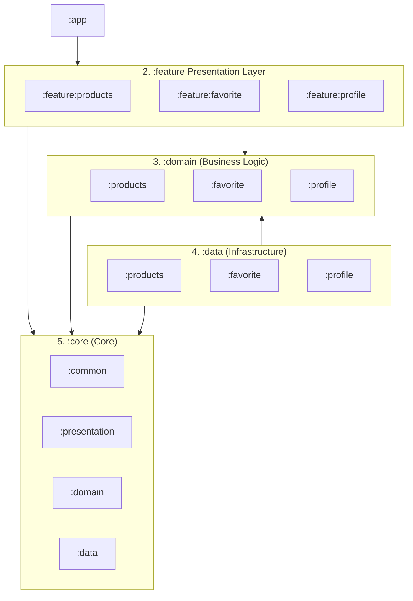

# 👕 Vestis App

  
  
  
  

  <strong>Vestis</strong> is a modular Android application built with Clean Architecture and MVI. It consumes the <em>FakeStore API</em> to manage a clothing catalog with a reactive local favorite system.

---

## 🚀 Features

* **👕 Catalog:** Product listing.
* **❤️ Favorites:** Reactive local persistence system using Room DB.
* **👤 Profile:** Displays user data and total favorites count.

---

## 🏗️ Architecture

The project is **Modularized** by layers and features to ensure scalability and separation of concerns:

* **`:app`** ➔ Core orchestrator, dependency injection, and global navigation.

* **`:feature`** ➔ Isolated presentation screens and user flows (MVI / Compose).
    * **`:feature:products` / `:feature:favorite` / `:feature:profile`**

* **`:domain`** ➔ Pure Kotlin layers holding business logic, business entities, and Use Cases.
    * **`:domain-products` / `:domain-favorite` / `:domain-profile`**

* **`:data`** ➔ Infrastructure implementations, API data sources (Retrofit), local caching and error handling.
    * **`:data-products` / `:data-favorite` / `:data-profile`**

* **`:core`** ➔ Shared utilities
    * **`:core-common` / `:core-presentation` / `:core-domain` / `:core-data`**

---

## 🛠️ Tech Stack

* **UI:** Jetpack Compose.
* **Asynchrony:** Kotlin Coroutines & Flows.
* **DI:** Hilt / Dagger.
* **Network & Local:** Retrofit + OkHttp & Room Database.
* **Image Loading:** Coil 3.

---

## 🧪 Testing

* **🧪 Unit Tests (`test/`):** ViewModels, Use cases and Repositories verified using **Turbine** and **MockK**.
* **📱 Android Tests (`androidTest/`):** Database instrumented validation.

---
